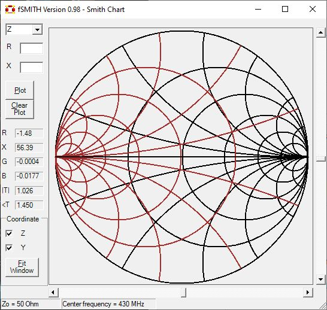

# Smith_Chart_Software

Windows Smith Chart software for RF circuit design.
This software allows the user to perform interactive impedance transformation and matching 
on a Smith Chart. Please visit this [blog](https://fkeng.blogspot.com/2016/03/smith-chart-software-for-rf-circuit.html)
for more information on the usage of the software. 

Written in Visual Basic .NET.
To compile:
1. Create a new Visual Basic Windows Application project in Visual Studio (Version 2013 onwards).
2. Add all the *.vb (visual basic code files) and *.resx (resource files) into the project.
3. Build the project.
4. Alternatively the pre-compile *.exe file is also included, which you can use immediately, for Windows 7 and above.  Just copy to the harddisk and it should be able to run immediately.
